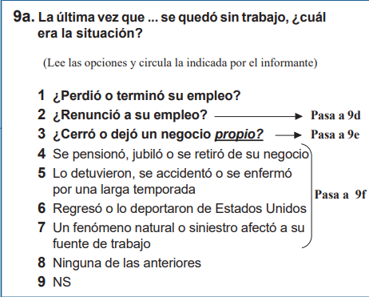
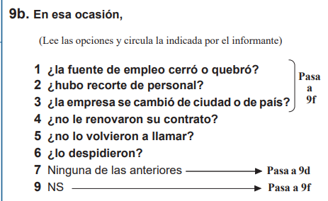

## Introduction

Employment transitions are an important indicator of labor market dynamics. Understanding why workers resign or lose their jobs provides valuable information for economists, policymakers, and businesses.

In this project, we analyzed data from the 2025 Q1 National Occupation and Employment Survey (ENOE) published by INEGI. Because ENOE uses a complex probabilistic sampling design, the analysis is performed with the survey package in R to produce nationally representative estimates.

Specifically, this report aims to answer these questions:

1)  Why do people voluntarily resign?
2)  Why do people lose their jobs?
3)  Do the reasons for unemployment differ between men and women?

## Surveys and Complex Samples

As mentioned earlier, we're going to analyze data from ENOE, which is conducted by the National Institute of Statistics and Geography (INEGI). In order to conduct a national survey you may imagine that is nearly impossible to interview all inhabitants of a country because of monetary and time costs, so it is necessary to rely on a probabilistic complex sampling design that allows accurate estimation of population characteristics while reducing costs.

A sample can give us good estimates of the whole population. For example, if we want to know the average height of students in a university, a sample created by a random selection of students will be sufficient to give us an approximation of the real average height of the whole university. However, the sample of a national survey can't be that simple, since it needs to represent the behavior of people with different characteristics throughout a country and variables under study can vary greatly from North to South, or from rural to urban areas or depend on socioeconomic status of the people. In order to provide estimates of different population clusters, we need to work with a complex sample.

Complex samples allows to represent subgroups of a population better than a simple random sample. Unlike a simple random sample, where all units of a population have the same probability of being selected, in a complex sample, units are drawn following a multiple stage process. In the case of ENOE, it consists on two stages. First of all, the National Institute of Statistics and Geography selects a master sample of Primary Sample Units (PSUs) with a probability proportional to the number of registered households in the most recent Census of Population and Housing. Next, a subsample of PSUs is selected with equal probability for each stratum. Finally, households are selected with the same probability for each PSU.

PSUs are created by INEGI using cartographic and demographic information from the latest Census of Population and Housing. A PSU is classified by federative entity, size of the area (rural, urban or urban's complement) and sociodemographic conditions of households.

A stratum is a group of people that share a common trait, it can be age, gender, race or it can be a geographic or temporal feature. Strata are useful in surveys to obtain insights of these groups, since observations of the complete population wouldn't be so valuable.

Stratification in ENOE is sociodemographic. There are four strata: low, middle-low, middle-high, and high. They are created by a statistical summary of 34 indicators that involves household's physical attributes and equipment, as well as sociodemographic features of the household members.

Weights or expansion factors are used to represent the correct number of people in a population. They are given as the inverse of the probability of selection of respondents. They are also crucial to adjust for nonresponse and oversampling.

There are some subpopulations that need to be oversampled, that is, giving them a greater chance of selection, because originally they were less likely to be chosen due to the smallness of the subpopulations or because they are hard-to-reach, such as the elderly, children or people living in rural areas. Later, at the estimation stage, in order to obtain results for the population, rather than just the sample, we use weights to compensate for oversampling.

## Data Preprocessing

We're interested in analyzing the reasons people voluntary left or lost a job with data from Q1 ENOE 2025. This information is contained in the database of ENOE's basic questionnaire part 2 of the corresponding period of time, specifically, at questions 9, 9a, 9b, 9c and 9d.








We start by loading the dataset corresponding to the second part of the questionnaire and the one with the sociodemographic variables of participants.

```{r}
# LOADING DATA SETS
coe2 <- read.csv("~/my-r-nbs/ENOE/conjunto_de_datos_coe2_enoe_2025_1t/conjunto_de_datos/conjunto_de_datos_coe2_enoe_2025_1t.csv", header = TRUE, sep = ",", stringsAsFactors = FALSE)
sdem <- read.csv("~/my-r-nbs/ENOE/conjunto_de_datos_sdem_enoe_2025_1t/conjunto_de_datos/conjunto_de_datos_sdem_enoe_2025_1t.csv", header = TRUE, sep = ",", stringsAsFactors = FALSE)
```

To improve readability throughout the analysis, categorical variables are converted from numeric codes into descriptive factor labels.

```{r}
coe2$p9_f_EverUnemployed <- factor(
  coe2$p9,
  levels = c(1,2,9),
  labels = c("Yes","No","Doesn't Know")
)
coe2$p9a_f_UnemployReason <- factor(
  coe2$p9a,
  levels = 1:9,
  labels = c(
    "Job loss",
    "Resigned", 
    "Business closure",
    "Retirement",
    "Accident/injury",
    "Deportation from USA",
    "Job affected by disasters",
    "None of the above",
    "Doesn't know"
  )
)
coe2$p9b_f_JobLossCause <- factor(
  coe2$p9b,
  levels = c(1, 2, 3, 4, 5, 6, 7, 9),
  labels = c(
    "The workplace closed or went bankrupt",
    "There was a layoff / downsizing",
    "The company relocated to another city or country",
    "Contract was not renewed",
    "Was not called back",
    "Was fired",
    "None of the above",
    "Doesn't know"
  )
)
coe2$p9c_f_ServiceTerminationReason <- factor(
  coe2$p9c,
  levels = c(1, 2, 3, 4, 5, 6, 7, 8, 9, 10, 99),
  labels = c(
    "Labor or union conflict",
    "Conflict with boss or supervisor",
    "Lack of qualifications or training",
    "No more work available",
    "Breach of contract",
    "Discrimination based on appearance",
    "Age (too young or too old)",
    "Illness or disability",
    "Pregnancy and/or maternal responsibilities",
    "None of the above",
    "Doesn't know"
  )
)
coe2$p9d_f_MainExitMotive <- factor(
  coe2$p9d,
  levels = c(1, 2, 3, 4, 5, 6, 7, 8, 9, 10, 11, 12, 99),
  labels = c(
    "Wanted to earn more",
    "Wanted independence",
    "Change or worsening in work conditions",
    "Risky and/or unhealthy work",
    "Was forced to resign or retire",
    "Lack of opportunities for advancement",
    "Harassment or lack of respect",
    "Conflict with boss or supervisor",
    "Marriage, pregnancy, or family responsibilities",
    "Family member prevented continuation",
    "Wanted to keep studying",
    "None of the above",
    "Doesn't know"
  ))
sdem$sex_f <- factor(
  sdem$sex,
  levels = c(1,2),
  labels = c("Man","Woman")
)
```

We merge the datasets using the primary key composed by tipo+ent+v_sel+n_hogar+h_mud+n_ren. This provides access to sociodemographic variables together with sample weights (`fac_tri`) and strata (`est_d_tri`), required for sample design. From the questionnaire dataset, we keep only the variables corresponding to the questions we're analyzing, `exit_motives_vars`

```{r}
primary_key <- c("tipo", "ent", "con", "v_sel", "n_hog", "h_mud", "n_ren")
# From the questionnaire, we keep just the questions related to events of 
# job loss or resignation
exit_motives_vars <- c(
  "p9",
  "p9_f_EverUnemployed",
  "p9a",
  "p9a_f_UnemployReason",
  "p9b",
  "p9b_f_JobLossCause",
  "p9c",
  "p9c_f_ServiceTerminationReason",
  "p9d",
  "p9d_f_MainExitMotive"
)
ExitMotives_df <- merge(
  sdem[,c(primary_key,"eda","sex","sex_f","r_def","c_res","upm","est_d_tri","fac_tri")],
  coe2[,c(primary_key,exit_motives_vars)],
  by=primary_key
)
```

## Library `survey`

R comes with a dedicated library for statistical analysis of complex survey samples, named `survey`. As you can recall, the essential components to define the sample design are PSUs, strata, and weights. Then,`survey` requires this data in order to be ready to compute statistical correct results.

```{r}
# Install survey, if you haven't already.
# install.packages('survey')

# Load library
library(survey)

# Definition of the sample design object
# ids = ~upm     -> PSUs
# strata = ~est_d_tri  -> Q1 2025 design strata
# weights = ~fac_tri -> Q1 2025 weights or expansion factors
# nest = TRUE        -> It means that IDs are repeated between strata
# data = ExitMotives_df  -> Our data
sdem_design <- svydesign(
  ids = ~upm,
  strata = ~est_d_tri,
  weights = ~fac_tri,
  nest = TRUE,
  data = ExitMotives_df
)
```

We use the next command to handle strata with a single PSU.

```{r}
options(survey.lonely.psu="adjust")
```

### Proportions

The subpopulation we're interested in is people aged 15 and older and habitual residents of a household (c_res=1). `r_def=0` refers to respondent with finished interview. We create this subpopulation with `subset`, whose arguments are the survey design object and the expression to filter data.

```{r}
sdem_subpop <- subset(sdem_design,  eda>=15 & eda<=98 & r_def==0 & c_res==1)
```

We're now ready to begin the data analysis.

## Exploratory Data Analysis

### First question: Why do people voluntarily leave their job?

We filter the data again to include only participants with meaningful answers, then, we will discard people who answered "None of the above" and "Doesn't know". Furthermore, we retain only respondents whose reason to be unemployed was quitting (p9a=2). We also filter out people who didn't get ask this question, that is, missing values.

We load library `dplyr` for data manipulation.

```{r}
library(dplyr)
resign_subpop <- subset(sdem_subpop, p9a == 2 & !is.na(p9d) & p9d != 99 & p9d != 12)
```

We use the function `svymean` to compute proportions of the variable to be analyzed.

```{r}
resign_motives_proportions <- svymean(~p9d_f_MainExitMotive, resign_subpop, na.rm=TRUE)
resign_motives_proportions
```

You can notice that the advantage of creating categorical variables is the ease of interpretation of results, as we can directly see the labels, therefore we don't have to worry about forgetting which response stands for which numeric code.

Let's make a horizontal bar chart to visualize the above results with gg2plot. First, we convert the results into a dataframe, because this way is easier for gg2plot to use.

```{r exit-motive-plot, fig.width = 12, fig.height = 5, warning=FALSE, message=FALSE}
# Load the necessary libraries
library(ggplot2)
library(forcats) # For reordering factor levels
library(scales) # For formatting numbers as percentages

# Create a dataframe
resign_df <- data.frame(
  Motive = gsub("p9d_f_MainExitMotive","",names(coef(resign_motives_proportions))),
  Proportion = as.numeric(coef(resign_motives_proportions))) %>%
    # Rearranged data for clarity
    arrange(desc(Proportion))

# Create the plot
exit_motive_plot <- resign_df %>%
  # Use fct_reorder() to sort the bars from highest to lowest proportion
  mutate(Motive = fct_reorder(Motive, Proportion)) %>%
  ggplot(aes(x = Motive, y = Proportion)) +
  
  # Use geom_col() for the bar chart. A single, strong color is often best.
  geom_col(fill = "#0072B2", alpha = 0.9) +
  
  # Flip coordinates to make the bar chart horizontal
  coord_flip() +
  
  # Add text labels showing the exact percentage on each bar
  geom_text(
    aes(label = percent(Proportion, accuracy = 0.1)), 
    hjust = -0.15, # Pushes the label just outside the bar
    size = 3.5,
    fontface = "bold",
    color = "gray20"
  ) +
  
  # Format the Y-axis to show percentages and expand it to make room for labels
  scale_y_continuous(
    labels = percent_format(),
    expand = expansion(mult = c(0, .15)) # Give 15% extra space on the right
  ) +
  
  # Add informative titles, subtitles, and a caption
  labs(
    title = "Why Did You Leave? Top Reasons for Resigning in Mexico",
    subtitle = "Analysis of individuals aged 15+ who left their job, Q1 2025",
    x = "", # The y-axis labels are self-explanatory, so we remove the axis title
    y = "Percentage of Respondents",
    caption = "Source: INEGI, Encuesta Nacional de Ocupación y Empleo (ENOE), Q1 2025. Results calculated using survey weights."
  ) +
  
  # Apply a clean, professional theme
  theme_minimal(base_size = 14) +
  theme(
    plot.title = element_text(face = "bold", size = 18),
    plot.subtitle = element_text(size = 12, color = "gray30"),
    plot.caption = element_text(hjust = 0, color = "gray50", margin = margin(t = 15)),
    panel.grid.major.y = element_blank(), # Remove horizontal grid lines for a cleaner look
    panel.grid.minor.x = element_blank(),
    axis.text.y = element_text(size = 11),
    axis.title.x = element_text(face = "bold", margin = margin(t = 10))
  )

# Display the plot
exit_motive_plot
```

These results suggest that family obligations are by far the primary resignation driver, accounting for nearly half of all responses in the first quarter of 2025. The other two most prominent reasons are salary and environment, highlighting that when workers leave due to work-specific reasons, wage improvement (18.4%) and deteriorating conditions (10.7%) are substantially more common triggers than interpersonal workplace friction or harassment.

### Second question: Why do people lose their job?

We are only keeping those people with a specific reason they lost their job. Also, they have to give as a reson of unemployment the answer "Job Loss" (p9a=1).

```{r}
jobloss_subpop <- subset(sdem_design, p9a == 1 & p9b !=7 & p9b != 9)
# proportions computed with svymean
joblosscauses_proportions <- svymean(~p9b_f_JobLossCause, jobloss_subpop, na.rm=TRUE)
joblosscauses_proportions
```

Let's make another horizontal bar plot.

```{r job-loss-plot, fig.width = 12, fig.height = 5, warning=FALSE, message=FALSE}
# Create a dataframe, since it is easier to interpret by gg2plot
joblosscauses_df <- data.frame(
  Proportion = coef(joblosscauses_proportions)
) %>%
  tibble::rownames_to_column(var="Cause") %>%
  mutate(
    Motive = gsub("p9b_f_JobLossCause","",Cause)
  ) %>%
  arrange(desc(Proportion))
# create the plot
job_loss_plot <- joblosscauses_df %>%
  # Use fct_reorder() to sort the bars from highest to lowest proportion
  mutate(Motive = fct_reorder(Motive, Proportion)) %>%
  ggplot(aes(x = Motive, y = Proportion)) +
  
  # Use geom_col() for the bar chart. A single, strong color is often best.
  geom_col(fill = "#0072B2", alpha = 0.9) +
  
  # Flip coordinates to make the bar chart horizontal
  coord_flip() +
  
  # Add text labels showing the exact percentage on each bar
  geom_text(
    aes(label = percent(Proportion, accuracy = 0.1)), 
    hjust = -0.15, # Pushes the label just outside the bar
    size = 3.5,
    fontface = "bold",
    color = "gray20"
  ) +
  
  # Format the Y-axis to show percentages and expand it to make room for labels
  scale_y_continuous(
    labels = percent_format(),
    expand = expansion(mult = c(0, .15)) # Give 15% extra space on the right
  ) +
  
  # Add informative titles, subtitles, and a caption
  labs(
    title = "Why Did You Lose Your Job? Top Reasons for Losing Job in Mexico",
    subtitle = "Analysis of individuals aged 15+ who lost their job, Q1 2025",
    x = "", # The y-axis labels are self-explanatory, so we remove the axis title
    y = "Percentage of Respondents",
    caption = "Source: INEGI, Encuesta Nacional de Ocupación y Empleo (ENOE), Q1 2025.\nResults calculated using survey weights."
  ) +
  
  # Apply a clean, professional theme
  theme_minimal(base_size = 14) +
  theme(
    plot.title = element_text(face = "bold", size = 18),
    plot.subtitle = element_text(size = 12, color = "gray30"),
    plot.caption = element_text(hjust = 0, color = "gray50", margin = margin(t = 15)),
    panel.grid.major.y = element_blank(), # Remove horizontal grid lines for a cleaner look
    panel.grid.minor.x = element_blank(),
    axis.text.y = element_text(size = 11),
    axis.title.x = element_text(face = "bold", margin = margin(t = 10))
  )

# Display the plot
print(job_loss_plot)
```

The two main drivers are related to structural economic pressures, such as, corporate restructuring, downsizing and business closures, that jointly account for 58.9% of total job loss, while temporary contracts ("Was not called back" and "Contract was not renewed") represent 27.4% of job losses, underscoring systemic job insecurity in the Mexican labor market.

### Third question: Why do people become unemployed? Reasons by gender.

Here we're going to use a new function,`svyby`, which performs cross tabulations.

First, we filter out the individuals who didn't get asked this question (question 9a) and retain people who gave an informative answer and reported to be unemployed someday (p9=1).

```{r}
unemployreason_subpop <- subset(sdem_subpop, !is.na(p9a) & p9a != 8 & p9a != 9)
```

`svyby` will create a cross tabulation of reasons of unemployment by gender.

```{r}
unemployreason_by_gender <- svyby(
  ~p9a_f_UnemployReason,
  by = ~sex_f,
  design = unemployreason_subpop,
  FUN = svymean,
  keep.var = FALSE
)
```

Now we'll convert the above result from wide format to a long format:

```{r}
# load library 
library(tidyr)
unemployreason_long <- unemployreason_by_gender %>%
  # Convertir el objeto svy a un data frame estándar
  as.data.frame() %>%
  # La función `pivot_longer` transforma los datos del formato wide al long
  pivot_longer(
    cols = -sex_f,
    names_to = "Motive",
    values_to = "Proportion"
  ) %>%
  # Limpia los nombres de las columnas y valores para claridad
  mutate(
    Motive = gsub("statistic\\.|p9a_f_UnemployReason","",Motive),
    # Renombrar la columna `sex_f` para que sea más descriptiva
    Gender = sex_f
  ) %>%
  # Seleccionar y reordenar las columnas finales para el CSV
  select(Gender, Motive, Proportion)
# Reorder motives by average proportion across genders
unemployreason_long <- unemployreason_long %>%
  group_by(Motive) %>%
  mutate(avg_prop = mean(Proportion)) %>%
  ungroup() %>%
  mutate(Motive = reorder(Motive, -avg_prop))  # Descending order
```

Let's create the visualization

```{r unemployment-gender-plot, fig.width = 12, fig.height = 5, warning=FALSE, message=FALSE}

# Reorder unemployment reasons by their average proportion across genders
unemployreason_long <- unemployreason_long %>%
  group_by(Motive) %>%
  mutate(avg_prop = mean(Proportion)) %>%
  ungroup() %>%
  mutate(Motive = fct_reorder(Motive, avg_prop))

# Create the plot
unemployment_gender_plot <- ggplot(
  unemployreason_long,
  aes(x = Motive, y = Proportion, fill = Gender)
) +
  
  # Grouped bars for gender comparison
  geom_col(
    position = position_dodge(width = 0.8),
    width = 0.7
  ) +
  
  # Add percentage labels
  geom_text(
    aes(
      label = percent(Proportion, accuracy = 0.1)
    ),
    position = position_dodge(width = 0.8),
    hjust = -0.15,
    size = 3.2,
    fontface = "bold",
    color = "gray20"
  ) +
  
  # Flip coordinates to improve readability of long category labels
  coord_flip() +
  
  # Format the axis as percentages
  scale_y_continuous(
    labels = percent_format(),
    expand = expansion(mult = c(0, .15))
  ) +
  
  # Titles and labels
  labs(
    title = "Reasons for Unemployment by Gender in Mexico",
    subtitle = "Analysis of individuals aged 15+ with a reported reason for unemployment, Q1 2025",
    x = "",
    y = "Percentage of Respondents",
    fill = "Gender",
    caption = "Source: INEGI, Encuesta Nacional de Ocupación y Empleo (ENOE), Q1 2025.\nResults calculated using survey weights."
  ) +
  
  # Apply the same visual style as the other plots
  theme_minimal(base_size = 14) +
  theme(
    plot.title = element_text(
      face = "bold",
      size = 18
    ),
    plot.subtitle = element_text(
      size = 12,
      color = "gray30"
    ),
    plot.caption = element_text(
      hjust = 0,
      color = "gray50",
      margin = margin(t = 15)
    ),
    
    # Remove unnecessary grid lines
    panel.grid.major.y = element_blank(),
    panel.grid.minor.x = element_blank(),
    
    axis.text.y = element_text(
      size = 10
    ),
    
    axis.title.x = element_text(
      face = "bold",
      margin = margin(t = 10)
    ),
    
    # Place legend above the plot, similar to the title hierarchy
    legend.position = "top",
    legend.title = element_text(face = "bold")
  )

# Display the plot
print(unemployment_gender_plot)
```

Resigned (voluntary departure) represents the largest category for both genders, but show a massive gender gap. Over half of unemployed women (55.1%) left their jobs voluntarily, compared to 32.7% of men. On the other hand, job loss (involutary displacement) is as important as the main driver for men, whereas for women it accounts for less than a fifth (19.6%) of unemployed women. We can also appreciate that males (20.8%) are nearly twice as likely to cite retirement as their reason for unemployment compared to females (10.5%).

# Conclusions

This analysis demonstrates how complex survey methods can be applied to obtain nationally representative estimates from ENOE. Using the survey package, we explored the main reasons behind job resignation and job loss in Mexico during the first quarter of 2025.

The workflow presented here—including data preprocessing, survey design specification, weighted estimation, and visualization—can be extended to investigate many other labor market questions contained in ENOE.
